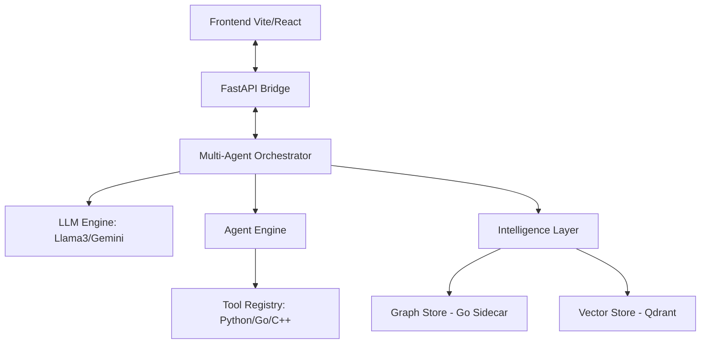

# Alana System: Industrial Multi-Agent Engineering Ecosystem

## 🌌 Visão Geral
O **Alana System** é um ecossistema de agentes autônomos de nível industrial projetado para resolução de problemas complexos de engenharia e análise de conhecimento em larga escala. Diferente de sistemas RAG convencionais, a Alana utiliza uma **Arquitetura Híbrida de Conhecimento Dinâmico**, integrando Bancos Vetoriais (Qdrant) e Grafos de Conhecimento (Semantic Knowledge Graphs) com motores de execução assíncronos de alta performance.

Este projeto demonstra senioridade em **Engenharia de Prompt, Sistemas Distribuídos, Concorrência em Python/Go e Arquitetura Multi-Agente**.

---

## 🛠️ Stack Tecnológica de Elite
- **Core Engine:** Python 3.11+ (Asyncio nativo para I/O não-bloqueante).
- **Inference Layer:** Orquestração híbrida entre **Ollama (Llama 3.1 local)** e **Google Gemini 2.0 Flash** (Multimodal fallback).
- **Vector Intelligence:** **Qdrant** (Vector Store) para busca semântica de alta dimensionalidade.
- **Graph Core:** Implementação proprietária de Grafos de Conhecimento com **Sidecar em Go** para processamento topológico de milissegundos.
- **Frontend:** Dashboard moderno em **React + Vite + TypeScript** com visualização de grafos em tempo real.
- **Backend:** **FastAPI** com arquitetura de Lifespan e injeção de dependências industrial.
- **NLP:** **spaCy** para extração de entidades e reconciliação semântica baseada em similaridade de cosseno.

---

## 🚀 Implementações Inovadoras (Diferenciais Técnicos)

### 1. O Efeito Anti-Borboleta (Knowledge Catalyst) 🌱
Uma implementação vanguardista de **Teoria do Caos aplicada ao Conhecimento**. O sistema identifica matematicamente "ilhas isoladas" no grafo e utiliza o LLM para propor "Pontes Semânticas". Isso permite que a Alana guie proativamente a ingestão de dados para maximizar a densificação do saber, reduzindo o caminho médio (ASP) entre conceitos.

### 2. Tool Maker: Auto-Sintetização de Ferramentas
A Alana possui a capacidade de **Metacognição de Ferramentas**. Caso encontre um problema matemático ou técnico para o qual não possua uma ferramenta pré-definida, ela utiliza o `SynthesizeTool` para gerar, validar e registrar dinamicamente novos módulos Python em tempo de execução, expandindo suas próprias capacidades de forma autônoma.

### 3. Reconciliação Semântica Híbrida
Utiliza embeddings de última geração (`SentenceTransformers`) para unificar entidades no grafo. O sistema entende que "BJT", "Transistor de Junção Bipolar" e "Transistores" referem-se ao mesmo objeto físico, garantindo a integridade da ontologia sem a rigidez do RDF clássico.

### 4. Orquestração Multi-Agente com Auditoria (Blackboard Pattern)
Arquitetura baseada em especialistas:
- **Librarian:** Gerencia a memória RAG e busca vetorial.
- **Engineer:** Executa código (Python/C++), simula terminais e realiza cálculos.
- **Auditor:** Valida cada passo da solução antes da entrega final, garantindo "Erro Zero" no output.

---

## 🏗️ Arquitetura do Sistema

---

## 📦 Características de Nível Enterprise
- **Namespace Isolation:** Garantia de que diferentes projetos/clientes tenham seus dados e ferramentas totalmente isolados no mesmo servidor.
- **Async Workflow:** Todo o fluxo de execução, desde a ingestão de PDFs massivos até a simulação de código, é 100% assíncrono.
- **Security First:** AST-based sanitization para execução de código gerado por IA e isolamento de caminhos via Pathlib.
- **Human-in-the-Loop:** Fila de aprovação para planos complexos antes da execução física.

---

## 📝 Conclusão
O Alana System  é um **Laboratório de Engenharia Autônoma**. Ele representa o estado da arte na união de sistemas simbólicos (Grafos) com conexistas (LLMs), focado em performance, escalabilidade e robustez técnica.

---
*Desenvolvido com foco em excelência arquitetural e inovação em IA.*
