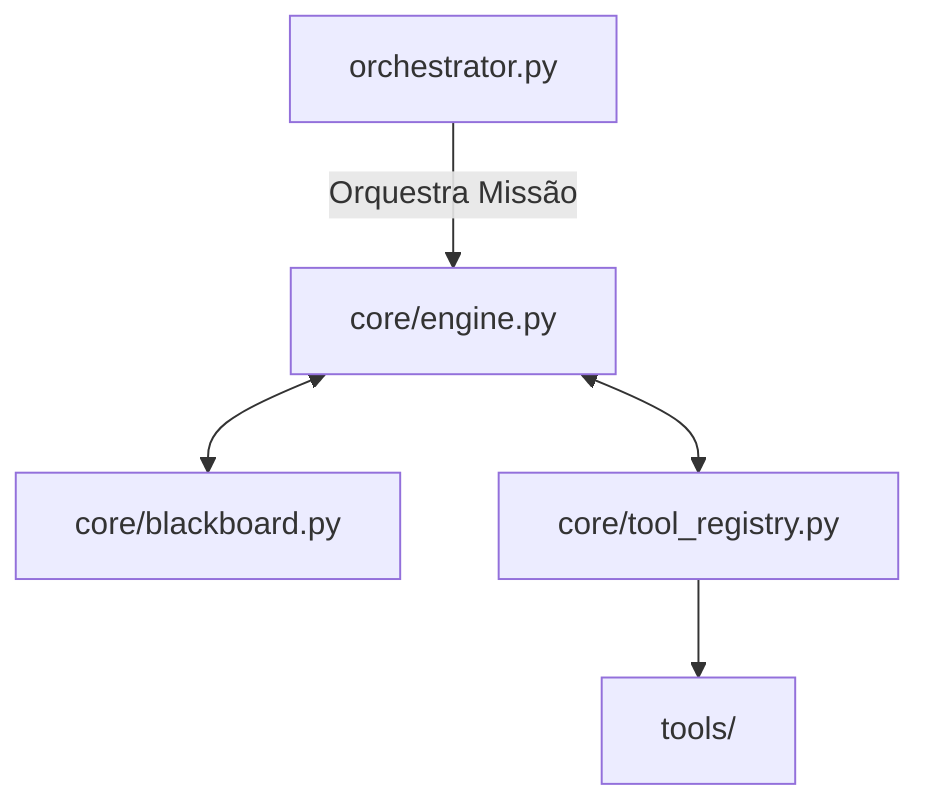

# 🤖 Arquitetura do Agente Alana (Mission Control)

Este diretório contém o núcleo de raciocínio e execução da Alana. A arquitetura segue o padrão de **Desacoplamento Cognitivo**, onde o pensamento, a memória e a ação são módulos independentes que se comunicam via interfaces estritas.

## 🏗️ Estrutura de Camadas



### 1. Core (O Cérebro)
Localizado em `core/`, contém os componentes que definem a inteligência:
- **`engine.py`**: Gerencia o loop ReAct. É responsável por transformar descrições de missões em cadeias de pensamento e chamadas de ferramentas.
- **`blackboard.py`**: O "Quadro Negro". Mantém o estado técnico da missão (fatos confirmados, falhas e estratégia). É o que impede a amnésia e redundância.
- **`tool_registry.py`**: Gerenciador de plugins. Desacopla o motor das ferramentas físicas.

### 2. Tools (As Mãos)
Localizado em `tools/`, contém a implementação física das capacidades:
- Todas as ferramentas **devem** herdar de `BaseTool`.
- Devem ser determinísticas em seus argumentos (uso de Type Hints).
- Devem retornar strings claras que ajudem a IA no processo de auto-correção.

---

## 🛠️ Como Adicionar uma Nova Ferramenta (Padrão de Elite)

Para adicionar uma nova capacidade à Alana, siga este fluxo:

1. **Crie o arquivo em `tools/`**:
   ```python
   from .base_tool import BaseTool

   class MinhaNovaTool(BaseTool):
       name = "nome_tecnico"
       description = "Descrição clara para a IA. Argumentos: 'arg1' (tipo)"

       def execute(self, arg1: str) -> str:
           try:
               # Lógica aqui
               return f"[SUCESSO] Resultado: {arg1}"
           except Exception as e:
               return f"[FALHA] Erro: {str(e)}"
   ```

2. **Registre no `AgentEngine`**:
   No arquivo `core/engine.py`, adicione o import no `__init__` (Lazy Loading) e registre no `self.registry`.

---

## 🛡️ Princípios de Design (Regras Inegociáveis)

1. **Lazy Loading**: Ferramentas pesadas devem ser importadas apenas dentro do `__init__` do Agente para evitar lentidão e imports circulares.
2. **Idempotência**: O `Blackboard` deve ser usado para evitar que a mesma ação falha seja repetida.
3. **Logs Limpos**: Use o logger `alana.agent.*` para rastreabilidade profissional.
4. **Resumo de Contexto**: Para missões longas, o `engine` deve usar a sumarização recursiva para manter o foco.

---

## 🧪 Verificação
Sempre que alterar o núcleo do agente, rode a suíte de testes:
```bash
python tests/test_agent_suite.py
```
